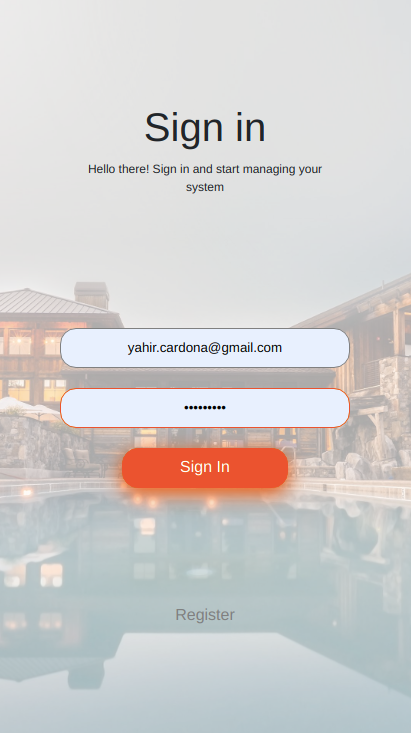
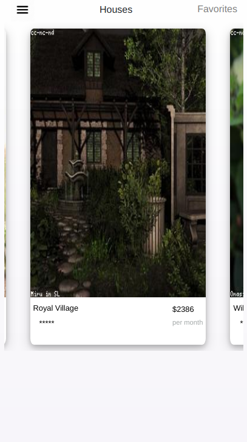
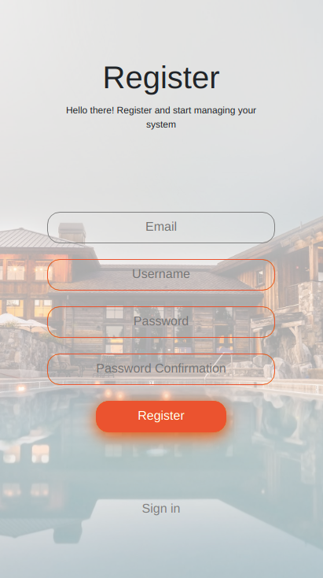

# Find House App

This project is a mobile app where you can find houses to rent. It has a full functional authentication. Each user can select his favorites houses and filter them.

  <p align="center">
      
  &nbsp; &nbsp; &nbsp; &nbsp;
    
  </p>

  <p align="center">
    
  &nbsp; &nbsp; &nbsp; &nbsp;
      
  </p>

<!-- ABOUT THE PROJECT -->
### Features
* Register your user with email, name and password.
* Login with secure password and tokens
* Display a list of houses in a scroll.
* You can click in each house to see further details.
* Add to favorites the houses you like.
* Filter the houses with the ones you add to favorites.

## Live Demo
It's deployed [here](https://yahir-houses-frontend.herokuapp.com)

### Built With
This project was built using these technologies.
* React
* JavaScript
* GitHub
* Redux
* Eslint
* Stylelint
* VScode
* Axios

### Getting Started

To get a local copy up and running follow these simple example steps.

### Prerequisites

 * [Node.js](https://nodejs.org/) is required to install dependencies and run scripts via npm.
 * A modern browser

### Clone
* Clone this repo:
  - Clone with SSH:
  ```
    git@github.com:yahir91/frontend_houses.git
  ```
  - Clone with HTTPS
  ```
    https://github.com/yahir91/frontend_houses.git
  ```

### Setup

Install dependencies:

```
$ npm install
```

Start the local webserver:

```$ npm start``` will open the project at local webserver at http://localhost:3000/ 


## Authors

## 👤 **Yahir Cardona**
Working as a FullStack developer on this project.

 [](https://yahir91.github.io/yahir-cardona.github.io/)

 [](https://www.linkedin.com/in/yahir-cardona/)

## Show your support

Give a :star: if you like this project!

## 📝 License

This project is [MIT](https://opensource.org/licenses/MIT) licensed.